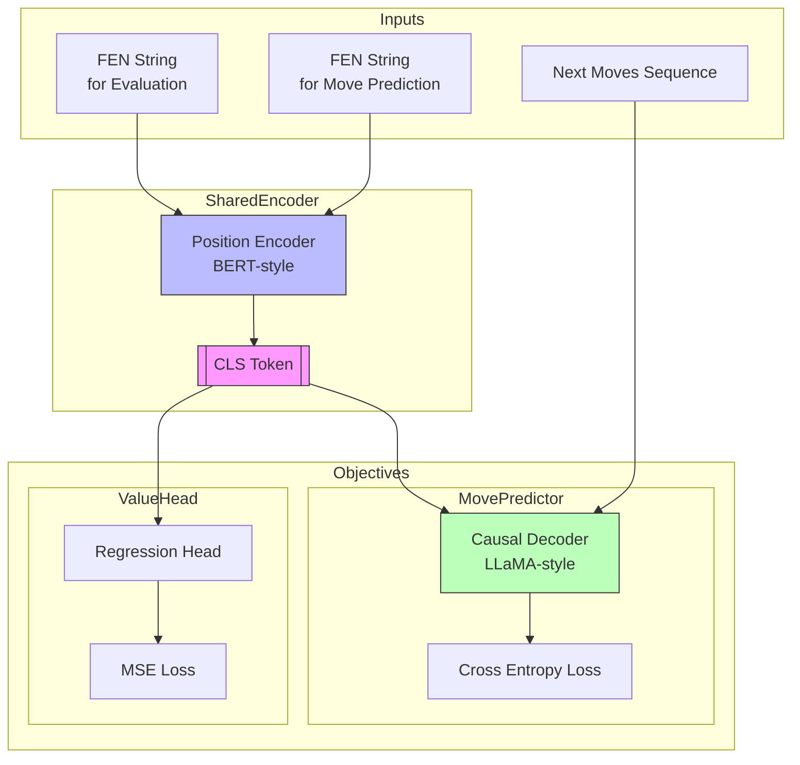

# Chess AI System Overview

## System Architecture

The system comprises two main components working in tandem: a position encoder and a move decoder. These components share information through a learned positional embedding, while serving distinct objectives.

### Position Encoder

The position encoder processes chess positions in FEN notation using a BERT-style transformer architecture. Its key features include:

- Bidirectional attention over the entire position
- Special [CLS] token that captures global position understanding
- Outputs both position embeddings and evaluation scores
- Trained on centipawn evaluations from engine analysis

### Move Decoder

The decoder follows a LLaMA-style architecture for generating moves. Notable characteristics include:

- Causal attention for move sequence generation
- Takes [CLS] token embedding as a prefix/conditioning
- Generates moves as sequences of square tokens
- Trained on both puzzle solutions and real game continuations

## Training Objectives

The system employs multi-task learning with two distinct objectives:

### Position Evaluation

- Input: FEN string of chess position
- Output: Centipawn evaluation score
- Loss: Mean Squared Error (MSE)
- Weighted by evaluation depth for more reliable training signals
- Range normalization: Mate scores mapped to ±20000 centipawns

### Move Prediction

- Input: FEN string + optional previous moves
- Output: Sequence of next moves
- Loss: Cross-entropy over square token predictions
- Special handling of puzzle positions vs game continuations
- Move separator tokens to maintain sequence structure

## Data Sources

# Chess AI System Overview

[Previous sections remain the same until Data Sources]

## Data Sources

### Lichess Standard Games Dataset

Primary source for strategic move prediction and ELO-based training:

- Scale: 6.2 billion standard rated games
- Key features:
  - Complete game moves in PGN format
  - Glicko2 ratings for both players
  - Game metadata (event type, time control, opening)
  - Engine analysis for ~6% of games
  - Clock information (since April 2017)

Training considerations:

- ELO-based sample weighting:
  - Below 1000: weight = 0.5
  - 1000-2000: linear scaling 0.5 to 1.5
  - Above 2000: weight = 1.5
- Filter by time control for quality
- Rich opening information for move context
- UTCDate for temporal analysis
- Game termination types for context

### Lichess Evaluations Dataset

Used for position evaluation training:

- 4.41M evaluated positions with engine analysis
- Key features:
  - FEN position
  - Centipawn evaluation
  - Mate score (when applicable)
  - Search depth
  - Principal variation
- Usage:
  - Primary source for evaluation head training
  - Depth-weighted sampling
  - Verified engine evaluations
  - Move sequences for validation

### Lichess Puzzles Dataset

Tactical training source:

- Curated tactical positions
- Fields:
  - Starting FEN
  - Correct move sequence
  - Puzzle rating
  - Themes (e.g., "mate", "fork", "pin")
- Usage:
  - weight based offf puzzle rating ranging between: 399 - 3.46k peaking around 1400ish
  - Validation benchmark
  - Tactical pattern learning
  - Theme-based testing

### Strategic Game Chess Dataset (LAION)

Supplemental training data:

- 3.2 billion self-play games
- Generated by Stockfish
- Features:
  - Full game sequences
  - Diverse opening positions
  - Game outcomes
  - Termination types
- Usage:
  - Fixed weight of 1.5 for training
  - Strategic pattern learning
  - Opening diversity
  - Endgame training

## Data Processing Strategy

I would like some percentage of lichess and lainon games to be randomly started in the middle. So the model can learn starting from any point. For full games the starting FEN should be passed in. this should happen for 50% of games.

### Game Selection and Weighting

1. Lichess Standard Games:

   - Parse complete PGN structure
   - Calculate average ELO for weighting
   - Consider time controls
   - Extract opening information
   - Handle clock times when available

2. Move Sequence Processing:

   - Unified UCI format conversion
   - Special move handling:
     - Castling (O-O, O-O-O)
     - Promotions with piece specification
     - Move separators for sequence clarity
   - Validation against board state

3. Position Evaluation:
   - Combine engine evaluations when available
   - Depth-based confidence weighting
   - Mate score normalization
   - Cross-validation between sources

### Training Data Composition

1. Balanced Sampling:

   - Strategic moves (Lichess games, weighted by ELO)
   - Tactical positions (Puzzles, fixed weight)
   - Self-play sequences (LAION, fixed weight)
   - Engine evaluations (weighted by depth)

2. Quality Filters:

   - Minimum ELO thresholds
   - Time control requirements
   - Completion status
   - Evaluation depth requirements

3. Augmentation:
   - Position mirroring
   - Color switching
   - Opening transpositions
   - Partial game sequences

[Rest of the document remains the same]

## Tokenization Strategy

### Position Tokenizer

- Handles FEN string components:
  - Piece positions
  - Side to move
  - Castling rights
  - En passant targets
- Special tokens for board structure
- Maintains spatial relationships

### Move Tokenizer

- Square-based tokenization:
  - Each square (a1-h8) is a distinct token
  - Moves represented as from-square + to-square pairs
  - Needs tokens for promotion [PROMOTE-Q], [PROMOTE-R], [PROMOTE-B], [PROMOTE-N], and "castle_kingside": "[O-O]", "castle_queenside": "[O-O-O]",
- Special tokens:
  - [BOS] Beginning of sequence
  - [EOS] End of sequence
  - [MOVE] Move separator
- Python-chess integration for parsing and starting games from random point
- Supports starting from any position

## Training Process

The training loop integrates both objectives:

1. Batch Preparation:

   - Mix of evaluation and move prediction samples
   - Position encoding shared between tasks
   - Separate decoders for each objective

2. Forward Pass:

   - Position encoded to [CLS] token
   - Evaluation head predicts centipawn score
   - Move decoder generates next moves
   - Losses computed for both objectives

3. Loss Combination:

   - Weighted sum of evaluation and prediction losses
   - Dynamic weighting based on task confidence
   - Gradient sharing through encoder

4. Validation:
   - Evaluation accuracy against engine scores
   - Move prediction accuracy on held-out puzzles
   - Separate metrics for tactical vs strategic positions

## Implementation Considerations

1. Data Processing:

   - Efficient loading of large datasets
   - Streaming support for game data
   - Balanced sampling across sources
   - Position de-duplication

2. Model Configuration:

   - Shared encoder dimensionality
   - Decoder capacity for move sequences
   - Attention mechanism optimization
   - Position embedding structure

3. Training Efficiency:
   - Gradient accumulation for large batches
   - Mixed precision training
   - Checkpoint management
   - Distributed training support

## Next Steps

1. Implementation Priority:

   - Position encoder and tokenizer
   - Move decoder and tokenizer
   - Data pipeline setup
   - Training loop implementation

2. Evaluation Framework:

   - Puzzle solving accuracy
   - Position evaluation correlation
   - Move prediction perplexity
   - Real-game prediction accuracy

3. Optimization:
   - Hyperparameter tuning
   - Architecture refinements
   - Training schedule optimization
   - Performance profiling
